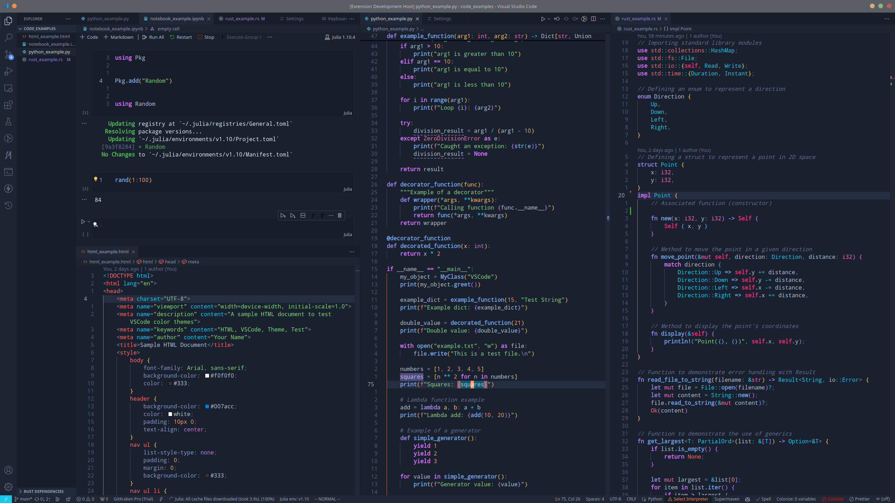
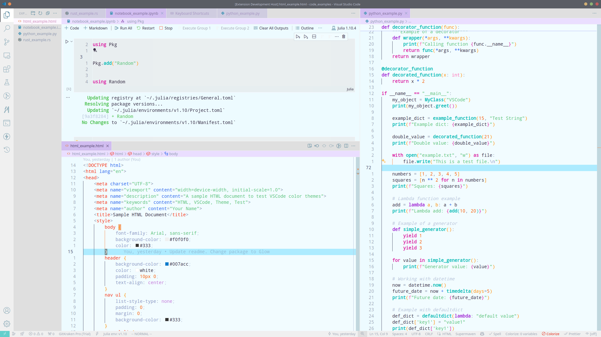

# Glow

This is a theme that was largely inspired by the Eva theme by 
[fisheva](https://github.com/fisheva/Eva-Theme). A lot of the color theory in the
dark theme is the same, but practically all of the colors have been redone to 
make the theme more vibrant.

## Glow Deep

This is the dark theme for this package, centered around the deep blue-gray background
as opposed to the warmer gray that is used in practically every default dark theme that
you see. The color scheme is meant to be reminiscent of glowing Jellyfish in the ocean.
Here are some pretty screenshots!

## Glow Balloon

This is a light theme that is meant to be a counterpart to Glow Deep. Instead of being
based on Jellyfish in the deep, the color scheme is designed to look like balloons floating
in the sky. Most importantly, the theme is NOT just the Glow Deep theme with the background
switched to white (switching to white NOT suddenly make your theme a light theme!). Some
screenshots!

